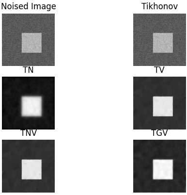

# Project 0
## Architecture
This Warm-up Project focuses more on code design than mathematical derivation, we collect some denoising algorithms together into [`Denoising`](0/model.py) class, and use abbreviation of algorithm name as function name (TV, TNV, TGV, TN, Tikhonov). Then we provide 3 apis to help you get started more easily. But if you want to customize instead, we recommend you to check source code of these apis to know more about our design.

```python
class Denoising:

    # magic functions

    def __init__(self, y=None): ...

    def __repr__(self): ...

    # apis

    def apply(self, algorithm, **kwargs): ...

    def show(self, *algorithms, raw=None, row=None, **kwargs): ...

    def add_noise(self, μ=0.5, σ=0.1): ...

    # algorithms

    def TV(self, λ=0.1, τ=0.01, ρ=1.0, epochs=100): ...

    def TNV(self, λ=0.1, τ=0.01, ρ=1.0, epochs=100): ...

    def TGV(self, λ1=0.1, λ2=0.15, τ=0.01, ρ=1.9, epochs=100): ...

    def TN(self, λ=0.1, init=0.5, epochs=100): ...

    def Tikhonov(self, λ=0.1): ...
```

The results are shown below.




## Requirements
We use `pipenv` to manage project virtual environment, and the version of `python` is 3.8, for this version is more parallel-friendly compared to others. You may check the requirements in [`Pipfile`](Pipfile) and [`Pipfile.lock`](Pipfile.lock).


## References
- https://lcondat.github.io/software.html
- http://g2s3.com/labs/notebooks/ImageDenoising.html
- https://image.hanspub.org/Html/16-2620635_25080.htm


- - -


# Project 1
## Architecture
pass


## References
- https://mathscinet.ams.org/mathscinet-getitem?mr=2496060
- https://computing.llnl.gov/tutorials/parallel_comp/
- https://mathscinet.ams.org/mathscinet-getitem?mr=2983026
- https://github.com/wenj18/HW_TV3d
